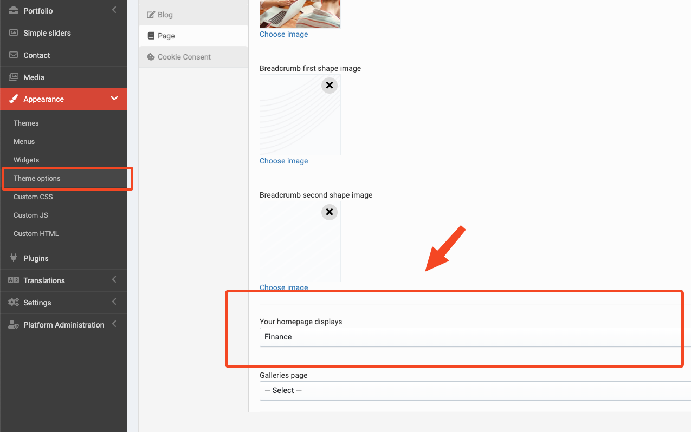
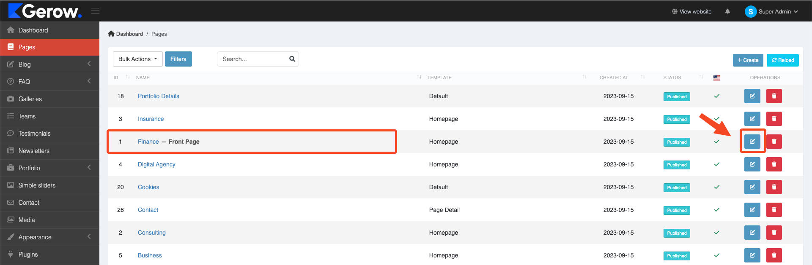

# Homepage

## Setup homepage

Go to Admin -> Appearance -> Theme options (tab Page) to select a homepage.

## Customize homepage

Go to Admin -> Pages -> Select Homepage.

### Hero Banner slider

It's shortcode `simple-slider` in the page content.

You can set the slider.

You can add the slider.

Now, You can set the slider.

### Hero banner

It's shortcode `hero-banner` in the page content.

You can set the title, subtitle, image, background image, button label, button action, platform Google Play, Apple Store, and options styling.

### Brands

It's shortcode `brands` in the page content.

You can set the title, subtitle, add new branch, and options styling.

### Services

It's shortcode `services` in the page content.

You can set the title, subtitle, image, background, services, and options styling.

### Request quote

It's shortcode `request-quote` in the page content.

You can set the title, subtitle, image, background, services, and options styling.

You can custom field in form (create or update).

### Pricing

It's shortcode `pricing` in the page content.

You can set the title, subtitle, image, background, services, and options styling.

You can custom features and information in packages.

### How It Works

It's shortcode `how-it-works` in the page content.

You can set the title, subtitle, image, background, and options styling.

### Testimonials

It's shortcode `testimonials` in the page content.

You also can custom items and more attributes in the `testimonials` shortcode.

### Projects

You also can custom items and more attributes in the `projects` shortcode.

### FAQ's

It's shortcode `faqs` in the page content.

You also can custom items and more attributes in the `faqs` shortcode.

### Call to action

It's shortcode `call-to-action` in the page content.

You also can custom items and more attributes in the `call-to-action` shortcode.

### News

It's shortcode `news` in the page content.

You also can custom items and more attributes in the `news` shortcode.

There are have alot of shortcodes in the theme. You can check them in the **Shortcode** dropdown menu in the editor.